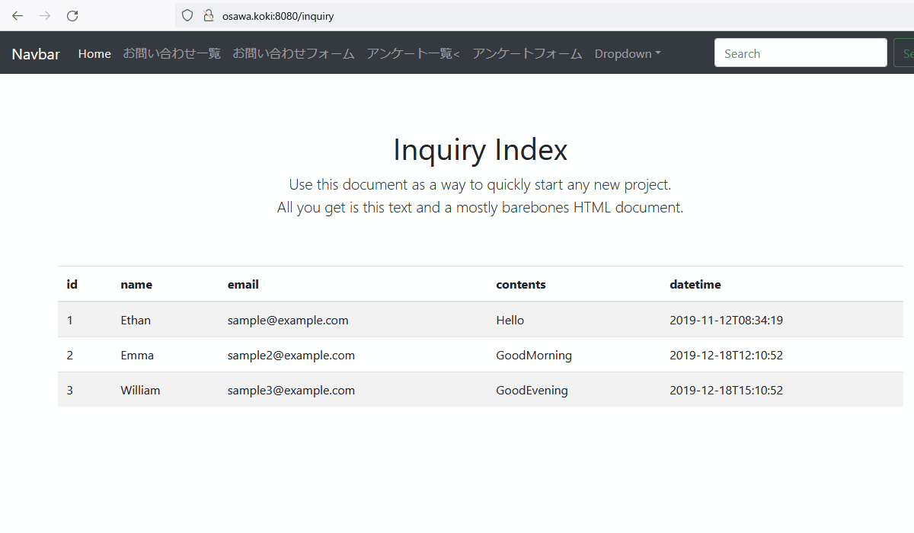

# SpringBasicSource.java

Springフレームワークについての学習用プロジェクト。  
がんばろ♪  

  

## 実行方法

普通にEclipseやIntelliJ IDEAで実行すればOK!  
<http://localhost:80>へアクセス。  

Dockerで実行するなら以下の通り。  

```shell
docker build -t java-spring-inquiry .
docker run -p 80:80 -it --rm --name my-java-spring-inquiry java-spring-inquiry

# 一行で書くなら
docker build -t java-spring-inquiry . && docker run -p 80:80 -it --rm --name my-java-spring-inquiry java-spring-inquiry
```

## デプロイ設定(Render.com)

| キー | バリュー |
| ---- | ---- |
| Name | java-spring-inquiry |
| Region | Oregon(US West) |
| Branch | main |
| Root Directory |  |
| Environment | Docker |
| Dockerfile Path | ./Dockerfile |
| Docker Build Context Directory |  |
| Docker Command |  |

## 自分用メモ

### @configuration

設定ファイルであることを示すアノテーション。

### @ControllerAdvice

メソッドの実行前の共通処理を指定する。  
空文字をnullに変換したりとか、、、  

### @SpringBootApplication

Springの設定を一括で。  

### リクエストスコープ

モデルが有効となるアクセスごとに生成されるスコープのこと。  
ViewがHTMLを生成する際に必要なデータを格納。  

### フラッシュスコープ

一度きりのセッション。  
リダイレクト後に一度だけ値を保持して表示する。  

### DI

「Dependency Injection」インスタンスを直接生成することなく、DIコンテナを介してインスタンスを取得するための仕組み。  
メリットは以下の通り。  
アノテーションで管理する。  

- インスタンスの生存期間を管理できる。
- テストがしやすくなる。(結合度が低くなる)

### 例外処理

以下の方法で実現することができる。  

- Controller単位で。
- ExceptionHandlerを使用して。

## ディレクトリ構成

```dir
- src
  - main (Javaコード)
  - resources
    - templates (HTMLとか)
    - static (CSSとかJSとか)
    - application.yml (データベースの設定 | 自動で読み込まれる)
    - *.sql (データベース作成後に実行されるSQL)
- build.gradle (パッケージの設定とかイロイロ)
```

## 参考文献

- <https://www.udemy.com/share/101w4u3@9mcf2Gbl_hYNQop2w8_6B5L4fzDhgXeC0rmsOpWTN-TSnJXFqZ2YWhllyGoI0LBbKw==/>
